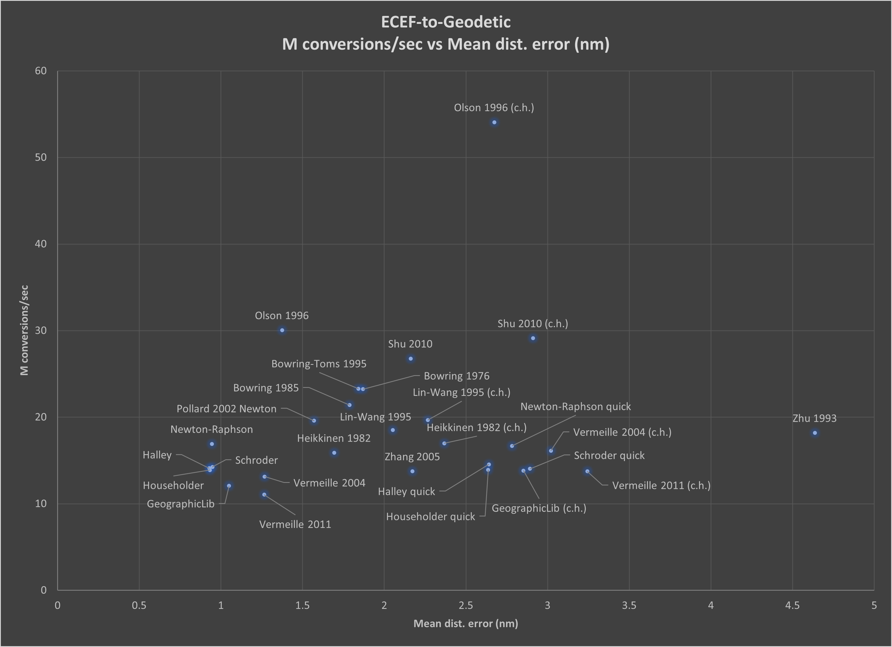

# ecef-geodetic

A test suite of ECEF-to-geodetic coordinate conversion functions

## Usage

To create the input data files
> `make -j $(nproc) input`

They are text files with ECEF and Geodetic coordinates.

To build the accuracy and speed tests
> `make -j $(nproc)`

To run the accuracy and speed tests
> `make acc speed`
* Takes about 10 minutes to finish
* Do not run these in parallel

The output of the accuracy and speed tests are json files which are put in the `results` folder.

See [Makefile](Makefile) for all possible targets.

## Requirements

### C++ libraries

- [Google Benchmark](https://github.com/google/benchmark)
- [fmt](https://github.com/fmtlib/fmt)
- [nlohmann-json](https://github.com/nlohmann/json)
- [oneTBB](https://github.com/oneapi-src/oneTBB)

### Python modules

- [gmpy2](https://github.com/aleaxit/gmpy)
- [matplotlib](https://matplotlib.org/)
- [more-itertools](https://github.com/more-itertools/more-itertools)
- [numpy](https://numpy.org/)

### Programs

See [Makefile](Makefile) for detailed list of programs that are required to run.

## Results

Only algorithms with a mean distance error less than 10nm were included in the figure below.  All iterative algorithms did 2 iterations.  "(c.h.)" means the algorithm used a "custom height" formula to calculate ellipsoid height instead of the standard formula.

*Scatter plot of ***accuracy***, measured by mean distance error (nm), versus ***speed***, measured in millions of conversions per second*

Results closer to the upper-left corner of the figure are better.
